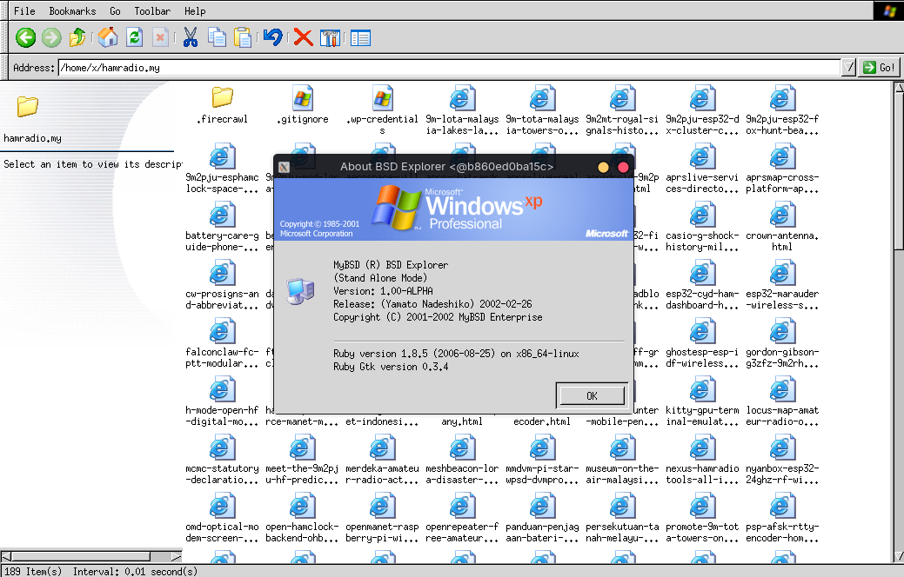

# MyBSD Tomoyo Explorer

[](https://github.com/9M2PJU/MyBSD-Tomoyo-Explorer/releases)
[](https://aur.archlinux.org/packages/tomoyo-explorer-bin)
[](#)
[](LICENSE)

**MyBSD Tomoyo Explorer** (also known historically as **BSD Explorer**) is a classic BSD/Unix graphical desktop file manager written in Ruby with GTK+ 1.2 and GdkPixbuf. Originally created between 1999 and 2002 by **Ariff Abdullah** (*skywizard*) as part of the **MyBSD Project** (Malaysian *BSD Users Group & Community).



---

## 📜 About the Author & History

### Ariff Abdullah (*skywizard*) & MyBSD
- **Author:** **Ariff Abdullah** (`skywizard@MyBSD.org.my` / `ariff@FreeBSD.org`)
- **Original Release:** `v1.00-ALPHA "Yamato Nadeshiko"` (February 26, 2002)
- **Community:** [MyBSD Project](http://www.MyBSD.org.my) — Malaysia's pioneering BSD Unix advocacy group and developer collective.

Ariff Abdullah (*skywizard*) was an esteemed Malaysian open source developer and official FreeBSD src/ports committer, widely recognized for his substantial contributions to the FreeBSD kernel sound subsystem (`sound(4)` / OSS audio driver architecture) and the Malaysian Unix community.

**Tomoyo Explorer** was created to provide a fast, modular, and lightweight graphical desktop file manager for FreeBSD and Unix workstations using Ruby and GTK+. It features customizable icon sets (WinXP, Windows, KDE2), a dual-pane canvas architecture, mount/filesystem usage indicators, file typing associations, and standalone or client-server execution modes.

---

## ⚡ 1-Liner Quick Install

Install on **Linux** (x86_64, arm64) or **FreeBSD** with a single command:

```bash
curl -fsSL https://raw.githubusercontent.com/9M2PJU/MyBSD-Tomoyo-Explorer/master/install.sh | bash
```

This installs `tomoyo-explorer` into `~/.local/bin/` and registers the desktop application menu launcher with icons.

---

## 📦 Installation Options

### 1. Arch Linux (AUR)

Install via your AUR helper of choice:

```bash
# Using yay
yay -S tomoyo-explorer-bin

# Using paru
paru -S tomoyo-explorer-bin
```

Or clone and build manually:
```bash
git clone https://aur.archlinux.org/tomoyo-explorer-bin.git
cd tomoyo-explorer-bin
makepkg -si
```

---

### 2. Standalone Linux AppImage (x86_64 / amd64)

Download the portable AppImage directly from [Releases](https://github.com/9M2PJU/MyBSD-Tomoyo-Explorer/releases):

```bash
# Download and make executable
curl -LO https://github.com/9M2PJU/MyBSD-Tomoyo-Explorer/releases/download/v1.00-ALPHA/MyBSD_Tomoyo_Explorer-x86_64.AppImage
chmod +x MyBSD_Tomoyo_Explorer-x86_64.AppImage

# Run
./MyBSD_Tomoyo_Explorer-x86_64.AppImage ~/
```

> **Self-Contained:** The AppImage bundles the Ruby runtime, GTK+ 1.2, GdkPixbuf loaders, and native C acceleration modules. It runs out-of-the-box on modern Linux distributions without requiring legacy system libraries.

---

### 3. Windows (.exe / .zip)

Download the Windows executable and distribution package from [Releases](https://github.com/9M2PJU/MyBSD-Tomoyo-Explorer/releases):

- **Standalone Executable:** [`MyBSD_Tomoyo_Explorer.exe`](https://github.com/9M2PJU/MyBSD-Tomoyo-Explorer/releases/download/v1.00-ALPHA/MyBSD_Tomoyo_Explorer.exe)
- **Complete ZIP Package:** [`MyBSD_Tomoyo_Explorer-win64.zip`](https://github.com/9M2PJU/MyBSD-Tomoyo-Explorer/releases/download/v1.00-ALPHA/MyBSD_Tomoyo_Explorer-win64.zip)

> **Windows Subsystem for Linux (WSL2):** On modern Windows 10/11, you can also launch directly with full graphical acceleration via WSL:
> ```powershell
> wsl curl -fsSL https://raw.githubusercontent.com/9M2PJU/MyBSD-Tomoyo-Explorer/master/install.sh | bash
> ```

---

### 4. FreeBSD Native

On FreeBSD systems, install runtime dependencies and run Tomoyo Explorer:

```bash
# Install Ruby and GTK 1.2 libraries
pkg install ruby18 ruby-gtk graphics/ruby-gdk_pixbuf

# Install using 1-liner installer
curl -fsSL https://raw.githubusercontent.com/9M2PJU/MyBSD-Tomoyo-Explorer/master/install.sh | bash
```

Or install via the included FreeBSD port skeleton:
```bash
cd freebsd/
make install clean
```

---

## 📂 Repository Contents

| Directory / File | Description |
| :--- | :--- |
| [`ruby-BSD-Explorer/`](ruby-BSD-Explorer/) | Tomoyo Explorer `v1.00-ALPHA` ("Yamato Nadeshiko") source code, C fixes, and icon themes. |
| [`windows/`](windows/) | Windows launcher source (`launcher.c`), resource script (`tomoyo.rc`), and build script. |
| [`aur/tomoyo-explorer-bin/`](aur/tomoyo-explorer-bin/) | Official Arch User Repository (AUR) package source. |
| [`freebsd/`](freebsd/) | FreeBSD port `Makefile` and package description. |
| [`gelojoh-current/`](gelojoh-current/) | Historical Gelojoh HTTP/SSL server in Ruby. |
| [`IPv6/`](IPv6/) | IPv6 test chat server/clients and RFC drafts. |
| [`install.sh`](install.sh) | Universal 1-liner installer for Linux and FreeBSD. |

---

## 📄 License & Attribution

- **Original Creator & Copyright Holder:** © 1999–2002 **Ariff Abdullah** (*skywizard*), MyBSD Project Team.
- **Repository Maintenance & Modern Packaging:** [9M2PJU](https://github.com/9M2PJU).
- **License:** Licensed under the **BSD 2-Clause License**. See the [`LICENSE`](LICENSE) file for details.
